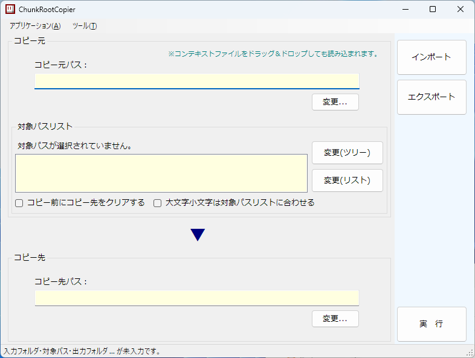
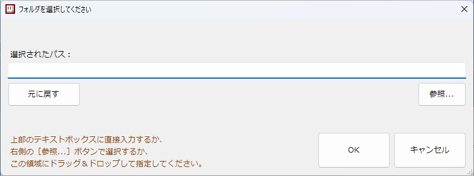
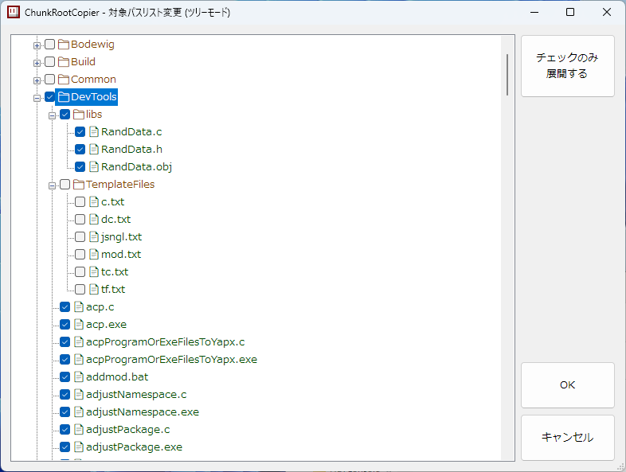
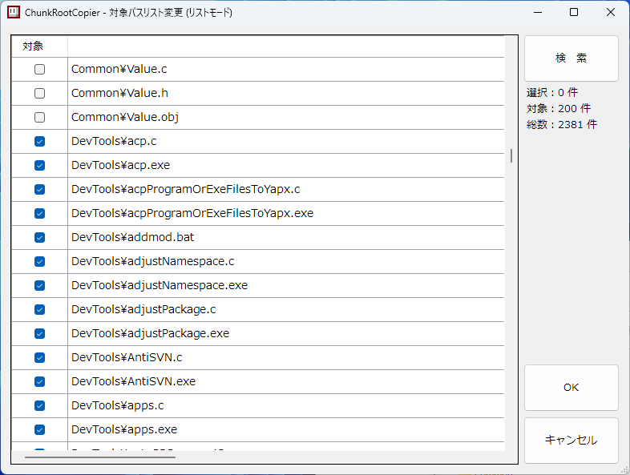
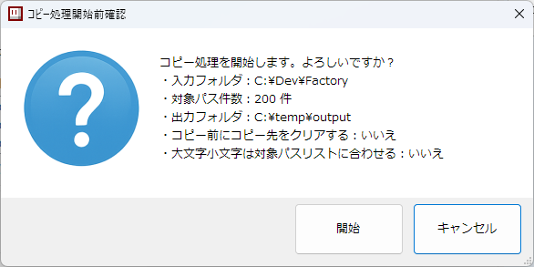
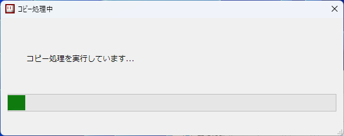
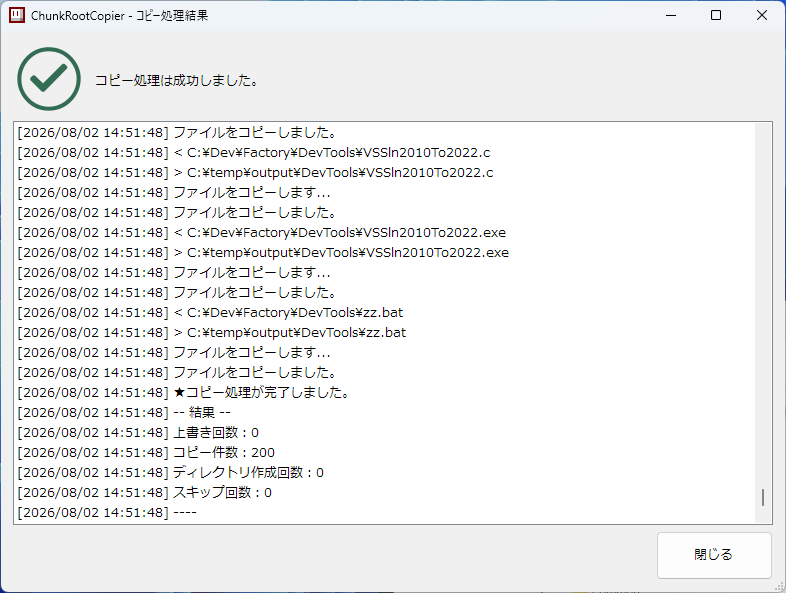

# ChunkRootCopier2

ChunkRootCopier2 は、入力ルート配下の一部のパスだけを、同じ相対パス構造で出力ルートへコピーする Windows 向け C# アプリケーションです。

## ユーザー向け説明

ChunkRootCopier2 は、フォルダ内の必要なファイルだけを選んで、別のフォルダへ同じ階層構造のままコピーするためのツールです。

たとえば、開発用フォルダの中から必要なソースファイルや設定ファイルだけを抜き出して、配布用フォルダや作業用フォルダへまとめたいときに使えます。

### 主な機能

- コピー元フォルダとコピー先フォルダを指定できます。
- コピー対象のパスをツリー形式またはリスト形式で選択できます。
- コピー対象リストをコンテキストファイルとしてインポート、エクスポートできます。
- コピー前にコピー先をクリアするかどうかを選択できます。
- パスの大文字小文字をコピー元の実在名に合わせるかどうかを選択できます。

### 基本的な使い方

1. メイン画面で「コピー元パス」を指定します。
2. 「対象パスリスト」の「変更(ツリー)」または「変更(リスト)」から、コピーしたいファイルを選択します。
3. 「コピー先パス」を指定します。
4. 必要に応じて、コピー前のクリアや大文字小文字の設定を変更します。
5. 「実行」を押します。
6. 確認画面で内容を確認し、「開始」を押します。
7. 結果画面でコピー結果を確認します。

### 画面

#### メイン画面

コピー元、対象パスリスト、コピー先、実行オプションを指定する画面です。



#### フォルダ選択画面

コピー元またはコピー先のフォルダを指定する画面です。直接入力、参照ボタン、ドラッグアンドドロップで指定できます。



#### 対象パスリスト変更画面(ツリーモード)

コピー元フォルダ配下をツリー表示し、チェックしたファイルをコピー対象にします。



#### 対象パスリスト変更画面(リストモード)

コピー元フォルダ配下のファイルを一覧表示し、チェック、検索、並び替えを使ってコピー対象を編集します。



#### コピー処理開始確認

コピー元、コピー先、対象件数、オプションを確認してからコピー処理を開始します。



#### コピー処理中

コピー処理の進行状況を表示します。



#### コピー処理結果

コピー処理の結果とログを表示します。



### コンテキストファイル

「エクスポート」を使うと、現在のコピー元、コピー先、対象パスリスト、オプションを XML ファイルとして保存できます。

保存した XML ファイルは「インポート」で読み込めます。よく使うコピー設定を保存しておくと、次回以降の作業を簡単に再現できます。

### 注意点

- 「コピー前にコピー先をクリアする」をオンにすると、コピー処理の前にコピー先フォルダ直下のファイルとサブフォルダが削除されます。
- コピー先に残したいファイルがある場合は、「コピー前にコピー先をクリアする」をオフにしてください。
- 対象パスリストに含まれていても、コピー元に存在しないファイルやフォルダはスキップされます。

## 開発者向け説明

ChunkRootCopier2 は、前身となる C 言語製コマンドラインツール [`Chroco.c`](https://github.com/stackprobe/CSharp2/blob/main/Factory/SubTools/Chroco.c) を GUI アプリケーションとして改良したものです。

リポジトリには次の 3 つのプロジェクトが含まれます。

| ディレクトリ | 役割 |
| --- | --- |
| `Chroco` | 実際のコピー処理を行うコンソールアプリケーション |
| `GUIChroco` | コピー対象の選択、コンテキストファイルの入出力、`Chroco` の起動を行う WinForms アプリケーション |
| `Installer` | `GUIChroco` と `Chroco` をインストール先へ展開する WinForms インストーラ |

アプリケーション名はインストーラ側の `Consts.APPLICATION_NAME` で `ChunkRootCopier`、表示用の長い名前は `CHROCO - CHunk ROot COpier` と定義されています。

## 開発環境

各プロジェクトは Visual Studio ソリューションとして分かれています。

| プロジェクト | ソリューション | 出力種別 | AssemblyName | Target Framework | Platform |
| --- | --- | --- | --- | --- | --- |
| `Chroco` | `Chroco/HLTConsole/HLTConsole.sln` | `Exe` | `HLTConsole` | .NET Framework 4.8 | x86 |
| `GUIChroco` | `GUIChroco/HLTForm/HLTForm.sln` | `WinExe` | `HLTForm` | .NET Framework 4.8 | x86 |
| `Installer` | `Installer/HLTForm/HLTForm.sln` | `WinExe` | `HLTForm` | .NET Framework 4.8 | x86 |

`Installer` はデスクトップショートカット作成のため、`IWshRuntimeLibrary` の COM 参照を持ちます。

## 主要な処理

### `Chroco`

入口は `Chroco/HLTConsole/HLTConsole/Program.cs` です。

`Chroco` は対象パスリストを読み込み、各行を入力ルートからの相対パスとして扱います。各対象について、入力側にファイルがあればファイルをコピーし、入力側にディレクトリがあれば出力側にディレクトリを作成します。入力側に存在しない場合はスキップします。

デフォルトではコピー開始前に出力ルート直下のファイルとサブディレクトリを削除します。出力ルート自体は削除されません。安全対策として、長さが 3 文字以下のディレクトリはクリーンアップできないようになっています。

デフォルトでは、対象パスの各パストークンについて入力ルート配下の実在名を大文字小文字を無視して探し、見つかった場合は実在名の大文字小文字に正規化します。`/-N` を指定するとこの正規化を行いません。

### `GUIChroco`

入口は `GUIChroco/HLTForm/HLTForm/Program.cs` です。

`GUIChroco` は WinForms UI で入力フォルダ、出力フォルダ、対象パスリスト、実行オプションを管理します。コピー実行時は一時作業ディレクトリに次のファイルを作成し、`Chroco` をレスポンスファイル指定で起動します。

| 一時ファイル | 内容 |
| --- | --- |
| `*_TargetRelPathList.txt` | UTF-8 の対象パスリスト |
| `*.response` | `Chroco /@` に渡すレスポンスファイル |
| `*.log` | `Chroco` のログ |
| `*.successful` | `Chroco` が正常完了時に作成する空ファイル |

`Consts.ChrocoExeFile` は、リリース配置では `..\Chroco\Chroco.exe` を探します。見つからない場合は、開発環境用に `..\..\..\..\..\Chroco\HLTConsole\HLTConsole\bin\Release\HLTConsole.exe` を探します。

GUI には対象パスを編集する画面が 2 つあります。

| 画面 | 内容 |
| --- | --- |
| `EditTreeWin` | 入力フォルダ配下をツリー表示し、チェックされたファイルを対象にする |
| `EditListWin` | 入力フォルダ配下のファイルを一覧表示し、チェック、ソート、検索で対象を編集する |

設定値は `GUIChroco.exe.settings.dat` に保存されます。保存対象には、読み込み可能なパス数の上限、検索ダイアログの最後の検索語、検索種別が含まれます。

### `Installer`

入口は `Installer/HLTForm/HLTForm/Program.cs`、主処理は `Installer/HLTForm/HLTForm/MainWin.cs` です。

インストーラは既定のインストール先として `%LOCALAPPDATA%\ChunkRootCopier` を使用します。インストール時は `GUIChroco.cmp-gz` と `Chroco.cmp-gz` を検証し、それぞれをインストール先の `GUIChroco`、`Chroco` ディレクトリへ展開します。

各クラスタファイルには `.hash` ファイルが必要です。インストール前に SHA-512 を計算し、`.hash` の内容と一致しない場合はインストールを中止します。

インストール済み判定には、インストール先に作成されるシグネチャファイル `HLT_<hash>` が使われます。ファイル名は `APPLICATION_NAME` と固定トレーラ文字列から SHA-512、Base32 を使って生成されます。

アンインストールは指定されたインストール先フォルダ全体を削除します。デスクトップショートカットが存在する場合は、削除するかを確認します。

## `Chroco` のコマンドライン

```bat
Chroco.exe /R コピー元 /D コピー先 /P 対象パスリストファイル [/L ログファイル] [/S 正常終了ファイル] [/-C] [/-N] [/PS]
```

| オプション | 内容 |
| --- | --- |
| `/R` | 入力ルートディレクトリ。存在するディレクトリである必要がある |
| `/D` | 出力ルートディレクトリ。存在するディレクトリである必要がある |
| `/P` | 対象パスリストファイル。既定の文字コードは UTF-8 |
| `/L` | ログ出力先ファイル。指定時は UTF-8 で追記される |
| `/S` | 正常完了時に作成する空ファイル |
| `/-C` | コピー前に出力ルートをクリアしない |
| `/-N` | 対象パスの大文字小文字を入力側の実在名に正規化しない |
| `/PS` | 対象パスリストファイルを Shift_JIS (`Encoding.GetEncoding(932)`) として読む |

`/@` を指定すると、UTF-8 のレスポンスファイルからパラメータを読みます。

```bat
Chroco.exe /@ response-file
```

レスポンスファイルは次の 7 行です。

```text
入力ルートディレクトリ
出力ルートディレクトリ
対象パスリストファイル
ログファイル
DontClearOutputDir
DontNormalizePathCase
正常終了ファイル
```

`DontClearOutputDir` と `DontNormalizePathCase` は `0` 以外で有効です。GUI からの実行では、チェックボックスの状態をこの形式へ変換して `Chroco` を起動します。

## コンテキストファイル

`GUIChroco` はインポート、エクスポートで XML 形式のコンテキストファイルを扱います。起動引数に `.xml` ファイルを 1 つ指定した場合、起動時にそのコンテキストを読み込みます。ウィンドウへのドラッグアンドドロップでも読み込みできます。

エクスポートされる構造は次の通りです。

```xml
<?xml version="1.0" encoding="UTF-8"?>
<ChunkRootCopier>
	<Context>
		<InputRootDir>...</InputRootDir>
		<OutputRootDir>...</OutputRootDir>
		<TargetRelPaths>
			<TargetRelPath>...</TargetRelPath>
		</TargetRelPaths>
		<Check1>True</Check1>
		<Check2>False</Check2>
	</Context>
</ChunkRootCopier>
```

`Check1` は「コピー前にコピー先をクリアする」、`Check2` は「大文字小文字は対象パスリストに合わせる」に対応します。

## 配布関連バッチ

各サブプロジェクトには `Release.bat` と `Clean.bat` があります。内容はいずれも `C:\Dev\Factory\bat\Dev` 配下の共通バッチを呼び出します。

| ファイル | 呼び出し先 |
| --- | --- |
| `*/Release.bat` | `C:\Dev\Factory\bat\Dev\Release\CommonReleaseProject.bat` |
| `*/Clean.bat` | `C:\Dev\Factory\bat\Dev\Clean\CommonCleanProject.bat` |
| `MakeDistribution.bat` | `C:\Dev\Factory\bat\Dev\MakeDistribution.bat` |

この README では、これらの共通バッチの内部仕様は確認していません。

## 注意点

- `Chroco` の `/D` は、コード上は既存ディレクトリを要求します。
- デフォルト実行では出力ルート直下がクリーンアップされます。既存データを保持する場合は `/-C` を指定します。
- `GUIChroco` の対象パス編集は入力フォルダ配下のファイルを対象にします。一方、`Chroco` 自体は対象パスリストにディレクトリが含まれている場合、出力側にディレクトリを作成します。
- `GUIChroco` は多重起動防止のため、実行ファイルの SHA-512 に基づくローカル Mutex とグローバル Mutex を使います。ハッシュは実行ファイルと同じ場所の `.hash-sig` に保存されます。
- このリポジトリには自動テストプロジェクトは見当たりません。
